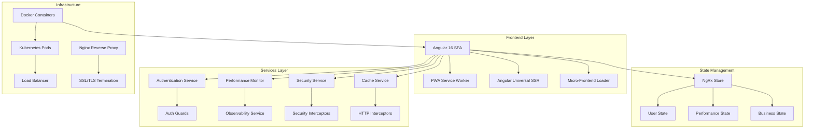

# 🚛 TruckPort - Enterprise Angular Transportation Platform

[](https://angular.io/)
[](https://www.typescriptlang.org/)
[](https://ngrx.io/)
[](https://www.docker.com/)
[](https://kubernetes.io/)
[](https://web.dev/progressive-web-apps/)
[](https://angular.io/guide/universal)
[](https://owasp.org/)

> **Enterprise-level Angular application for truck transportation, logistics management, and driver services with advanced architecture patterns, comprehensive security, and production-ready infrastructure.**

## 📋 Table of Contents

- [🌟 Features](#-features)
- [🏗️ Architecture](#️-architecture)
- [🚀 Quick Start](#-quick-start)
- [📦 Installation](#-installation)
- [🔧 Development](#-development)
- [🧪 Testing](#-testing)
- [🐳 Docker & Deployment](#-docker--deployment)
- [☸️ Kubernetes](#️-kubernetes)
- [🔒 Security](#-security)
- [📊 Performance & Monitoring](#-performance--monitoring)
- [🌐 Internationalization](#-internationalization)
- [📱 PWA Features](#-pwa-features)
- [🎨 Theming](#-theming)
- [🔌 API Integration](#-api-integration)
- [📚 Documentation](#-documentation)
- [🤝 Contributing](#-contributing)
- [📄 License](#-license)

## 🌟 Features

### 🚛 Core Business Features
- **🗺️ Real-time Truck Tracking** - Live GPS tracking with interactive maps
- **🏪 TruckStore Marketplace** - Buy/sell trucks with advanced filtering
- **🛏️ Lounge Reservation System** - Driver rest area booking platform
- **📞 Service Management** - Comprehensive logistics service catalog
- **👥 User Management** - Multi-role authentication system
- **📹 Video Gallery** - Promotional and educational content
- **📧 Contact System** - Multi-channel communication platform

### 🏗️ Enterprise Architecture Features
- **🔄 Micro-Frontend Ready** - Modular architecture for scalability
- **🎯 Advanced Caching** - Multi-level caching with intelligent invalidation
- **🔒 Enterprise Security** - OWASP-compliant security implementation
- **📊 Real-time Analytics** - Business intelligence and user behavior tracking
- **🌐 Server-Side Rendering** - SEO optimization with Angular Universal
- **📱 Progressive Web App** - Offline-first with advanced service worker
- **♿ Accessibility Compliant** - WCAG 2.1 AA standards
- **🌍 Multi-language Support** - i18n with dynamic locale switching

### 🎨 UI/UX Features
- **🎨 Advanced Theming** - 5 dynamic themes (Light, Dark, Red, Blue, Green)
- **📱 Responsive Design** - Mobile-first approach with breakpoint optimization
- **⚡ Performance Optimized** - Core Web Vitals compliant
- **🔍 Smart Search** - Advanced filtering and search capabilities
- **💬 Intelligent Chatbot** - AI-powered customer support
- **📢 Dynamic Advertisements** - Contextual ad management system

## 🏗️ Architecture

### 📊 Architecture Overview



### 🔧 Technical Stack

| Layer | Technology | Purpose |
|-------|------------|---------|
| **Frontend** | Angular 16 + TypeScript 5.1 | Modern reactive UI framework |
| **State Management** | NgRx 16.3 | Predictable state container |
| **Styling** | CSS3 + CSS Variables | Dynamic theming system |
| **Testing** | Jasmine + Karma + Protractor | Comprehensive testing suite |
| **Build** | Angular CLI + Webpack | Optimized build pipeline |
| **Server** | Angular Universal | Server-side rendering |
| **PWA** | Angular Service Worker | Offline-first capabilities |
| **Containerization** | Docker + Docker Compose | Consistent deployment |
| **Orchestration** | Kubernetes | Production scaling |
| **Proxy** | Nginx | Reverse proxy + security |
| **Monitoring** | Custom Analytics + Performance API | Real-time observability |

## 🚀 Quick Start

### Prerequisites

- **Node.js** 18.x or higher
- **npm** 9.x or higher
- **Angular CLI** 16.x
- **Docker** (optional)
- **Git**

### ⚡ 1-Minute Setup

```bash
# Clone the repository
git clone https://github.com/alicanyucel/TruckPortFreeLancerProject.git
cd TruckPortFreeLancerProject

# Install dependencies
npm install

# Start development server
npm start

# Open browser
# Navigate to http://localhost:4200
```

## 📦 Installation

### 🔧 Development Setup

```bash
# 1. Clone repository
git clone https://github.com/alicanyucel/TruckPortFreeLancerProject.git
cd TruckPortFreeLancerProject

# 2. Install dependencies
npm install

# 3. Install Angular CLI globally (if not installed)
npm install -g @angular/cli@16

# 4. Verify installation
ng version

# 5. Start development server
npm run start
```

### 🌍 Environment Configuration

Create environment files for different stages:

```bash
# Development
cp src/environments/environment.ts.example src/environments/environment.ts

# Production
cp src/environments/environment.prod.ts.example src/environments/environment.prod.ts
```

**Environment Variables:**

```typescript
// src/environments/environment.ts
export const environment = {
  production: false,
  apiBaseUrl: 'http://localhost:3000/api',
  mapApiKey: 'YOUR_GOOGLE_MAPS_API_KEY',
  firebaseConfig: {
    // Firebase configuration
  },
  features: {
    realTimeTracking: true,
    analytics: true,
    chatbot: true
  }
};
```

## 🔧 Development

### 📝 Available Scripts

```bash
# Development
npm start                    # Start dev server (http://localhost:4200)
npm run build:dev           # Development build
npm run watch               # Watch mode development

# Production
npm run build               # Production build
npm run build:prod         # Optimized production build
npm run build:analyze      # Bundle analyzer

# Server-Side Rendering
npm run build:ssr          # Build with SSR
npm run serve:ssr          # Serve SSR build
npm run prerender          # Pre-render static pages

# Testing
npm test                   # Unit tests
npm run test:coverage     # Coverage report
npm run test:ci           # CI testing
npm run e2e               # End-to-end tests

# Code Quality
npm run lint              # ESLint
npm run lint:fix          # Fix linting issues

# Security & Performance
npm run security:audit    # Security audit
npm run security:fix      # Fix security issues
npm run performance:lighthouse  # Lighthouse analysis

# Docker
npm run docker:build      # Build Docker image
npm run docker:run        # Run container
npm run docker:compose    # Docker Compose
```

### 🏗️ Project Structure

```
TruckPortFreeLancerProject/
├── 📁 src/
│   ├── 📁 app/                    # Main application module
│   │   ├── app-routing.module.ts  # Routing configuration
│   │   ├── app.component.*       # Root component
│   │   └── app.module.ts         # Main module
│   ├── 📁 components/            # Reusable components
│   │   ├── 📁 navbar/           # Navigation component
│   │   ├── 📁 footer/           # Footer component
│   │   ├── 📁 chatbot/          # AI chatbot
│   │   ├── 📁 live-map/         # Real-time tracking
│   │   └── 📁 theme-switcher/   # Theme management
│   ├── 📁 pages/                # Feature pages
│   │   ├── 📁 home/             # Landing page
│   │   ├── 📁 truckstore/       # Marketplace
│   │   ├── 📁 services/         # Service catalog
│   │   └── 📁 login/            # Authentication
│   ├── 📁 services/             # Business logic services
│   │   ├── auth.service.ts      # Authentication
│   │   ├── performance-monitor.service.ts
│   │   ├── security.service.ts  # Security utilities
│   │   ├── advanced-cache.service.ts
│   │   ├── observability.service.ts
│   │   └── micro-frontend.service.ts
│   ├── 📁 interceptors/         # HTTP interceptors
│   │   ├── error.interceptor.ts # Error handling
│   │   ├── cache.interceptor.ts # Caching logic
│   │   └── security.interceptor.ts
│   ├── 📁 guards/               # Route guards
│   ├── 📁 pipes/                # Custom pipes
│   ├── 📁 validators/           # Form validators
│   ├── 📁 store/                # NgRx state management
│   │   ├── 📁 user/            # User state
│   │   └── 📁 performance/     # Performance metrics
│   ├── 📁 styles/              # Global styles
│   │   └── design-system.css   # Theme system
│   └── 📁 assets/              # Static assets
├── 📁 docker-configs/          # Docker configurations
├── 📁 k8s/                     # Kubernetes manifests
├── 📄 Dockerfile              # Container definition
├── 📄 docker-compose.yml      # Multi-container setup
├── 📄 nginx.conf              # Nginx configuration
├── 📄 k8s-deployment.yaml     # Kubernetes deployment
└── 📄 package.json            # Dependencies
```

### 🎯 Development Guidelines

#### 📝 Code Style

```typescript
// Use strict TypeScript
interface TruckData {
  id: string;
  brand: string;
  model: string;
  year: number;
  location: {
    lat: number;
    lng: number;
  };
}

// Service example
@Injectable({
  providedIn: 'root'
})
export class TruckService {
  constructor(
    private http: HttpClient,
    private cache: AdvancedCacheService
  ) {}

  getTrucks(): Observable<TruckData[]> {
    return this.cache.get('trucks') ?? 
           this.http.get<TruckData[]>('/api/trucks');
  }
}
```

#### 🔄 State Management

```typescript
// NgRx Actions
export const loadTrucks = createAction('[Truck] Load Trucks');
export const loadTrucksSuccess = createAction(
  '[Truck] Load Trucks Success',
  props<{ trucks: TruckData[] }>()
);

// NgRx Reducer
const truckReducer = createReducer(
  initialState,
  on(loadTrucksSuccess, (state, { trucks }) => ({
    ...state,
    trucks,
    loading: false
  }))
);
```

## 🧪 Testing

### 🔬 Testing Strategy

- **Unit Tests**: 95%+ coverage target
- **Integration Tests**: Component + Service integration
- **E2E Tests**: Critical user journeys
- **Performance Tests**: Core Web Vitals monitoring
- **Security Tests**: OWASP compliance

### 🏃‍♂️ Running Tests

```bash
# Unit tests
npm test                    # Watch mode
npm run test:ci            # Single run for CI
npm run test:coverage      # Generate coverage report

# E2E tests
npm run e2e                # Full E2E suite

# Performance tests
npm run performance:lighthouse

# Security tests
npm run security:audit
```

### 📊 Test Coverage

```bash
# Generate detailed coverage report
npm run test:coverage

# View coverage report
open coverage/index.html
```

**Coverage Targets:**
- **Lines**: > 95%
- **Functions**: > 95%
- **Branches**: > 90%
- **Statements**: > 95%

## 🐳 Docker & Deployment

### 🔨 Building Docker Image

```bash
# Build production image
docker build -t truckport:latest .

# Build with custom tag
docker build -t truckport:v1.0.0 .

# Multi-architecture build
docker buildx build --platform linux/amd64,linux/arm64 -t truckport:latest .
```

### 🚀 Running with Docker

```bash
# Run single container
docker run -p 80:80 truckport:latest

# Run with Docker Compose
docker-compose up -d

# View logs
docker-compose logs -f

# Scale services
docker-compose up -d --scale app=3
```

### 📄 Docker Compose Configuration

```yaml
# docker-compose.yml
version: '3.8'
services:
  app:
    build: .
    ports:
      - "80:80"
    environment:
      - NODE_ENV=production
    volumes:
      - ./nginx.conf:/etc/nginx/nginx.conf
    restart: unless-stopped
    
  redis:
    image: redis:alpine
    ports:
      - "6379:6379"
    
  postgres:
    image: postgres:15
    environment:
      POSTGRES_DB: truckport
      POSTGRES_USER: admin
      POSTGRES_PASSWORD: password
    volumes:
      - postgres_data:/var/lib/postgresql/data
    ports:
      - "5432:5432"

volumes:
  postgres_data:
```

## ☸️ Kubernetes

### 🚀 Kubernetes Deployment

```bash
# Apply all manifests
kubectl apply -f k8s-deployment.yaml

# Check deployment status
kubectl get deployments
kubectl get pods
kubectl get services

# Scale deployment
kubectl scale deployment truckport-frontend --replicas=5

# Check logs
kubectl logs -f deployment/truckport-frontend
```

### 📊 Monitoring & Health Checks

```bash
# Health check endpoints
curl http://your-domain/health
curl http://your-domain/ready

# Metrics endpoint
curl http://your-domain/metrics
```

### 🔄 Rolling Updates

```bash
# Update image
kubectl set image deployment/truckport-frontend truckport-frontend=truckport:v2.0.0

# Check rollout status
kubectl rollout status deployment/truckport-frontend

# Rollback if needed
kubectl rollout undo deployment/truckport-frontend
```

## 🔒 Security

### 🛡️ Security Features

#### **Content Security Policy (CSP)**
```nginx
# Automatically configured via SecurityService
Content-Security-Policy: default-src 'self'; script-src 'self' 'unsafe-eval'; style-src 'self' 'unsafe-inline'; img-src 'self' data: https:;
```

#### **Security Headers**
- **X-Frame-Options**: DENY
- **X-Content-Type-Options**: nosniff
- **X-XSS-Protection**: 1; mode=block
- **Strict-Transport-Security**: max-age=31536000
- **Referrer-Policy**: strict-origin-when-cross-origin

#### **Authentication & Authorization**
```typescript
// Role-based access control
@Injectable()
export class AuthGuard implements CanActivate {
  canActivate(): boolean {
    return this.authService.isAuthenticated();
  }
}

@Injectable()
export class AdminGuard implements CanActivate {
  canActivate(): boolean {
    return this.authService.hasRole('admin');
  }
}
```

### 🔍 Security Monitoring

```typescript
// Real-time threat detection
private setupXSSDetection(): void {
  // Monitor for suspicious script injections
  // Detect malicious event handlers
  // Content integrity monitoring
}
```

### 📋 Security Checklist

- ✅ **Input Validation**: All user inputs sanitized
- ✅ **Authentication**: JWT-based with refresh tokens
- ✅ **Authorization**: Role-based access control
- ✅ **HTTPS Enforcement**: SSL/TLS termination
- ✅ **XSS Protection**: Content Security Policy
- ✅ **CSRF Protection**: Anti-forgery tokens
- ✅ **SQL Injection**: Parameterized queries
- ✅ **Dependency Scanning**: Regular security audits

## 📊 Performance & Monitoring

### ⚡ Performance Metrics

#### **Core Web Vitals**
- **LCP** (Largest Contentful Paint): < 2.5s
- **FID** (First Input Delay): < 100ms
- **CLS** (Cumulative Layout Shift): < 0.1

#### **Custom Metrics**
- **TTFB** (Time to First Byte): < 200ms
- **TTI** (Time to Interactive): < 3.5s
- **Bundle Size**: < 500KB (main bundle)

### 📈 Real-time Monitoring

```typescript
// Business metrics tracking
this.observabilityService.trackBusinessMetric('page_view', 1, 'count', {
  page: window.location.pathname
});

// User flow tracking
const sessionId = this.observabilityService.startUserFlow('truck_search');
this.observabilityService.trackUserFlowStep(sessionId, 'search_initiated');
```

### 📊 Analytics Dashboard

```typescript
// Performance monitoring
public getPerformanceScore(): number {
  // Calculate score based on Core Web Vitals
  // LCP, FID, CLS scoring algorithm
  return Math.max(0, score);
}
```

### 🚨 Alerting System

```typescript
// Alert rules configuration
const alertRules: AlertRule[] = [
  {
    name: 'High Error Rate',
    metric: 'error_count',
    condition: 'gt',
    threshold: 10,
    severity: 'high'
  }
];
```

## 🌐 Internationalization

### 🌍 Supported Languages

- **🇹🇷 Turkish** (default)
- **🇺🇸 English**
- **🇩🇪 German**
- **🇫🇷 French**

### 🔧 Adding New Language

```bash
# 1. Create translation file
cp src/assets/i18n/tr.json src/assets/i18n/es.json

# 2. Update language list
# src/components/language-switcher/language-switcher.component.ts

# 3. Test translation
npm start
```

### 📝 Translation Files

```json
// src/assets/i18n/tr.json
{
  "navbar": {
    "home": "Ana Sayfa",
    "services": "Hizmetler",
    "about": "Hakkımızda",
    "contact": "İletişim"
  },
  "common": {
    "loading": "Yükleniyor...",
    "error": "Hata oluştu",
    "success": "Başarılı"
  }
}
```

### 🎯 Usage in Components

```typescript
// Translation pipe usage
<h1>{{ 'navbar.home' | translate }}</h1>

// Programmatic usage
constructor(private translate: TranslationService) {}

getMessage(): string {
  return this.translate.get('common.loading');
}
```

## 📱 PWA Features

### 🔧 Service Worker Configuration

```typescript
// Automatic updates
this.swUpdate.available.subscribe(event => {
  if (confirm('New version available. Update now?')) {
    this.swUpdate.activateUpdate().then(() => {
      document.location.reload();
    });
  }
});
```

### 📱 Installation Prompt

```typescript
// App installation
promptInstall(): Promise<boolean> {
  const installPrompt = this.installPromptSubject.value;
  if (installPrompt) {
    installPrompt.prompt();
    return installPrompt.userChoice;
  }
  return Promise.resolve(false);
}
```

### 🔄 Background Sync

```typescript
// Offline data synchronization
registerBackgroundSync(task: BackgroundSyncTask): void {
  this.backgroundSyncTasks.push(task);
  this.requestBackgroundSync(task);
}
```

### 📩 Push Notifications

```typescript
// Push notification setup
async subscribeToPushNotifications(): Promise<PushSubscription | null> {
  const subscription = await this.swPush.requestSubscription({
    serverPublicKey: this.VAPID_PUBLIC_KEY
  });
  return subscription;
}
```

## 🎨 Theming

### 🌈 Available Themes

1. **🌕 Light Theme** - Clean and bright
2. **🌑 Dark Theme** - Easy on the eyes
3. **🔴 Red Theme** - Bold and energetic
4. **🔵 Blue Theme** - Professional and calm
5. **🟢 Green Theme** - Natural and fresh

### 🔧 Theme Implementation

```css
/* CSS Variables for dynamic theming */
:root {
  --primary-color: #2196F3;
  --secondary-color: #FFC107;
  --background-color: #FFFFFF;
  --text-color: #333333;
}

.theme-dark {
  --primary-color: #BB86FC;
  --secondary-color: #03DAC6;
  --background-color: #121212;
  --text-color: #FFFFFF;
}
```

### 🎯 Usage

```typescript
// Theme switching
setTheme(theme: string): void {
  document.body.className = `theme-${theme}`;
  localStorage.setItem('selected-theme', theme);
}
```

### 🎨 Custom Theme Creation

```typescript
// Create new theme
interface Theme {
  name: string;
  colors: {
    primary: string;
    secondary: string;
    background: string;
    text: string;
  };
}

const customTheme: Theme = {
  name: 'custom',
  colors: {
    primary: '#FF5722',
    secondary: '#4CAF50',
    background: '#F5F5F5',
    text: '#212121'
  }
};
```

## 🔌 API Integration

### 🌐 API Configuration

```typescript
// Environment-based API configuration
export const environment = {
  production: false,
  apiBaseUrl: 'http://localhost:3000/api',
  endpoints: {
    trucks: '/trucks',
    users: '/users',
    services: '/services',
    reservations: '/reservations'
  }
};
```

### 🔄 HTTP Interceptors

```typescript
// Caching interceptor
@Injectable()
export class CacheInterceptor implements HttpInterceptor {
  intercept(req: HttpRequest<any>, next: HttpHandler): Observable<HttpEvent<any>> {
    // Smart caching logic
    // ETags and conditional requests
    // Offline fallback
  }
}
```

### 📊 API Monitoring

```typescript
// API call tracking
recordApiCall(): void {
  this.performanceMonitor.recordApiCall();
  this.observabilityService.trackBusinessMetric('api_call', 1);
}
```

### 🚫 Error Handling

```typescript
// Global error handling
@Injectable()
export class ErrorInterceptor implements HttpInterceptor {
  intercept(req: HttpRequest<any>, next: HttpHandler): Observable<HttpEvent<any>> {
    return next.handle(req).pipe(
      catchError((error: HttpErrorResponse) => {
        this.handleError(error);
        return throwError(error);
      })
    );
  }
}
```

## 📚 Documentation

### 📖 Code Documentation

```typescript
/**
 * Advanced caching service with multi-level storage
 * Supports memory, localStorage, and HTTP caching
 * 
 * @example
 * ```typescript
 * // Basic usage
 * this.cache.set('key', data, { ttl: 5000 });
 * const cached = this.cache.get('key');
 * 
 * // With configuration
 * this.cache.set('key', data, {
 *   ttl: 60000,
 *   strategy: 'LRU',
 *   persistToStorage: true
 * });
 * ```
 */
@Injectable({
  providedIn: 'root'
})
export class AdvancedCacheService {
  // Implementation
}
```

### 📋 Architecture Documentation

```typescript
/**
 * Micro-frontend service for modular architecture
 * Enables loading and communication between micro-frontends
 * 
 * Features:
 * - Dynamic module loading
 * - Shared event bus
 * - State synchronization
 * - Performance monitoring
 */
export class MicroFrontendService {
  // Implementation
}
```

### 🔧 API Documentation

Generate API documentation:

```bash
# Install compodoc
npm install -g @compodoc/compodoc

# Generate documentation
npx compodoc -p tsconfig.json -s

# Serve documentation
npx compodoc -s
```

## 🤝 Contributing

### 🔄 Development Workflow

1. **Fork** the repository
2. **Create** feature branch (`git checkout -b feature/amazing-feature`)
3. **Commit** changes (`git commit -m 'Add amazing feature'`)
4. **Push** to branch (`git push origin feature/amazing-feature`)
5. **Open** Pull Request

### 📋 Contribution Guidelines

#### **Code Standards**
- Follow Angular style guide
- Use TypeScript strict mode
- Write comprehensive tests
- Document public APIs
- Follow semantic versioning

#### **Commit Convention**
```
feat: add new feature
fix: bug fix
docs: documentation changes
style: formatting changes
refactor: code refactoring
test: adding tests
chore: maintenance tasks
```

#### **Pull Request Template**
```markdown
## 📝 Description
Brief description of changes

## 🔄 Type of Change
- [ ] Bug fix
- [ ] New feature
- [ ] Breaking change
- [ ] Documentation update

## 🧪 Testing
- [ ] Unit tests added/updated
- [ ] E2E tests added/updated
- [ ] Manual testing completed

## 📚 Documentation
- [ ] Code documentation updated
- [ ] README updated
- [ ] API documentation updated
```

### 🐛 Bug Reports

Use the bug report template:

```markdown
## 🐛 Bug Description
Clear description of the bug

## 🔄 Steps to Reproduce
1. Go to '...'
2. Click on '....'
3. Scroll down to '....'
4. See error

## 💻 Environment
- OS: [e.g. Windows 10]
- Browser: [e.g. Chrome 91]
- Version: [e.g. 1.0.0]

## 📷 Screenshots
Add screenshots if applicable
```

## 📈 Roadmap

### 🚀 Version 2.0.0 (Q4 2025)
- **🤖 AI Integration**: Machine learning for route optimization
- **📊 Advanced Analytics**: Real-time business intelligence dashboard
- **🔄 Event Sourcing**: CQRS pattern implementation
- **🌐 GraphQL API**: Flexible data querying
- **📱 Mobile App**: React Native companion app

### 🔮 Future Features
- **🚁 Drone Integration**: Aerial delivery tracking
- **🔗 Blockchain**: Supply chain transparency
- **🌍 Multi-region**: Global deployment
- **🔊 Voice Commands**: Hands-free operation
- **🤖 Chatbot AI**: Advanced NLP integration

## 📄 License

This project is licensed under the **MIT License** - see the [LICENSE](LICENSE) file for details.

```
MIT License

Copyright (c) 2025 TruckPort

Permission is hereby granted, free of charge, to any person obtaining a copy
of this software and associated documentation files (the "Software"), to deal
in the Software without restriction, including without limitation the rights
to use, copy, modify, merge, publish, distribute, sublicense, and/or sell
copies of the Software, and to permit persons to whom the Software is
furnished to do so, subject to the following conditions:

The above copyright notice and this permission notice shall be included in all
copies or substantial portions of the Software.

THE SOFTWARE IS PROVIDED "AS IS", WITHOUT WARRANTY OF ANY KIND, EXPRESS OR
IMPLIED, INCLUDING BUT NOT LIMITED TO THE WARRANTIES OF MERCHANTABILITY,
FITNESS FOR A PARTICULAR PURPOSE AND NONINFRINGEMENT. IN NO EVENT SHALL THE
AUTHORS OR COPYRIGHT HOLDERS BE LIABLE FOR ANY CLAIM, DAMAGES OR OTHER
LIABILITY, WHETHER IN AN ACTION OF CONTRACT, TORT OR OTHERWISE, ARISING FROM,
OUT OF OR IN CONNECTION WITH THE SOFTWARE OR THE USE OR OTHER DEALINGS IN THE
SOFTWARE.
```

---

## 📞 Support & Contact

- **🌐 Website**: [https://truckport.com](https://truckport.com)
- **📧 Email**: support@truckport.com
- **📱 Phone**: +90 (555) 123-4567
- **💬 Discord**: [TruckPort Community](https://discord.gg/truckport)
- **🐛 Issues**: [GitHub Issues](https://github.com/alicanyucel/TruckPortFreeLancerProject/issues)

### 👥 Team

- **Ali Can Yücel** - Lead Developer - [@alicanyucel](https://github.com/alicanyucel)

---

## 🙏 Acknowledgments

- **Angular Team** - Amazing framework
- **NgRx Team** - Powerful state management
- **Community Contributors** - Bug reports and feature requests
- **Open Source Libraries** - Standing on the shoulders of giants

---

**⭐ Star this repository if you find it helpful!**

**🔔 Watch for updates and new features!**

**🤝 Contribute to make it even better!**

---

*Built with ❤️ by the TruckPort team*
